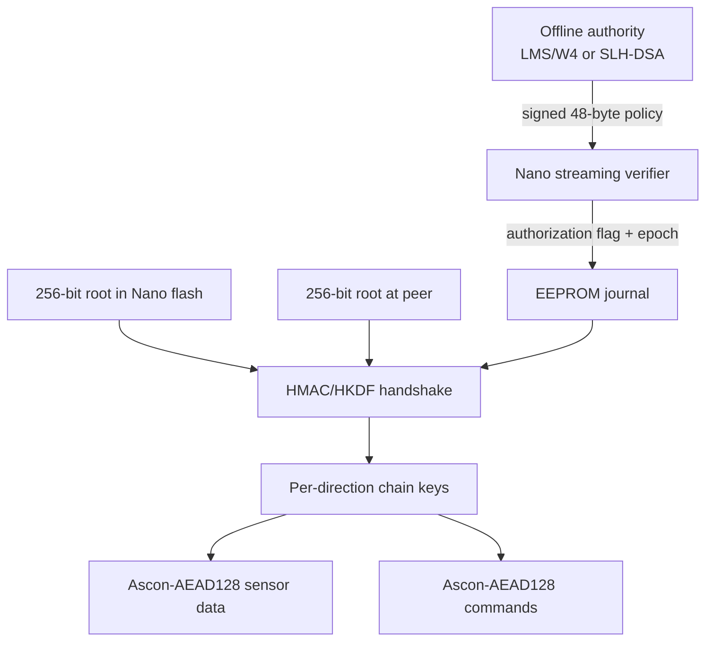

# NanoPQ-SecureLink

NanoPQ-SecureLink is a runnable secure sensor/actuator link for the classic
Arduino Nano (ATmega328P, 16 MHz, 32 KiB flash, 2 KiB SRAM). It replaces the
failed “run ML-KEM-512 on every connection” design with a measured combination
that fits:

- streamed post-quantum authorization with RFC 8554 LMS H5/W4 by default;
- a FIPS 205 SLH-DSA-SHA2-128s stateless alternative;
- a unique 256-bit pre-provisioned device root;
- mutual HMAC-SHA-256/HKDF-SHA-256 session establishment;
- NIST Ascon-AEAD128 encrypted sensor and command records;
- an EEPROM boot epoch and per-direction hash ratchets for reset and replay
  safety.

The default compiled AVR image passes the complete simulated workflow with
18,188 bytes of flash, 1,354 bytes of executed peak SRAM, and 694 bytes of
remaining SRAM. Its one-time LMS/W4 authorization takes 105,538,287 AVR cycles,
or 6.596 seconds at 16 MHz.

Physical-board execution is the only uncompleted evidence gate in this
environment because no serial Arduino device is exposed here. The package
contains the flashable HEX, a real POSIX serial peer, and exact commands for the
connected Nano.

## Architecture



The signature is verified only for enrollment or policy cutover and is never
buffered in SRAM. Each verifier read request is flow-controlled over UART. The
live session then uses the independently provisioned 256-bit root; that root is
never transmitted.

## Why this is different from the failed build

| Profile | Role | Flash | Static SRAM | Executed/lower-bound stack | Total peak | Headroom | Result |
|---|---|---:|---:|---:|---:|---:|---|
| Old C0 ML-KEM-512 | KEM every session | 20,118 | 2,016 | ≥611 | ≥2,627 | ≤−579 | Fails |
| LMS H5/W4 | Rare PQ authorization + PSK sessions | 18,188 | 587 | 767 | 1,354 | 694 | Passes AVR simulation |
| LMS H5/W8 | Rare PQ authorization + PSK sessions | 18,188 | 587 | 767 | 1,354 | 694 | Passes AVR simulation |
| SLH-DSA-SHA2-128s | Rare PQ authorization + PSK sessions | 19,268 | 597 | 767 | 1,364 | 684 | Passes AVR simulation |

The roles are deliberately shown because a signature-authorized PSK protocol is
not a KEM replacement for deployments that require public-key key establishment
or forward secrecy.

## Reproduce everything

Requirements: a POSIX host with `make`, `cc`, Python 3, Node.js, and npm.
The pinned npm dependency supplies the AVR compiler and simulator.

```bash
npm ci --cache .npm-cache
make verify
make sanitizer-test
make benchmark
```

Expected host-test summary:

```text
PASS: primitives, handshake, key confirmation, encrypted sensor traffic, tamper, replay, ratchet, and reset freshness
PASS: FIPS 205 SLH-DSA-SHA2-128s valid vector, tamper, truncation, and 7856-byte streaming consumption
PASS: RFC 8554 LMS H5/W4 valid vector, tamper, truncation, and 2348-byte streaming consumption
PASS: RFC 8554 LMS H5/W8 valid vector, tamper, truncation, and 1292-byte streaming consumption
```

`make benchmark` executes all three compiled ATmega328P programs in avr8js. It
does not merely run host C code. The simulation verifies:

- streamed post-quantum authorization;
- mutual session-key confirmation;
- decryption of an ADC sensor record;
- rejection of a modified command without advancing the receive ratchet;
- acceptance of a valid encrypted LED command;
- replay rejection;
- EEPROM authorization persistence;
- boot-epoch advancement and changed keys after reset;
- dynamic stack high-water and the whole-program SRAM gate.

The machine-readable result is
[`evidence/same-target-benchmark.json`](evidence/same-target-benchmark.json).

## Flash and run a physical Nano

Install `avrdude`, attach the classic Nano, and identify its port.

```bash
make peer
make factory-reset PORT=/dev/ttyUSB0
make flash PORT=/dev/ttyUSB0
build/host/nanopq-peer --port /dev/ttyUSB0 --tamper-demo
```

The default bootloader upload speed is 57,600 baud. For a Nano using the newer
bootloader:

```bash
make flash PORT=/dev/ttyUSB0 UPLOAD_BAUD=115200
```

The firmware protocol itself always uses 115,200 baud. A successful first run
shows enrollment, a mutually authenticated session, an encrypted ADC value, a
rejected tampered command, an accepted LED command, and a rejected replay.

Alternative images:

```bash
make flash-lms-w8 PORT=/dev/ttyUSB0
make flash-slh PORT=/dev/ttyUSB0
```

Run `make factory-reset` before changing authorization profiles; otherwise the
valid EEPROM enrollment flag intentionally survives resets.

## Evidence levels

- `PASS` in host tests means native deterministic tests passed.
- `PASS_SIMULATOR` means the linked AVR machine code completed the full path in
  the ATmega328P simulator and met the measured memory gate.
- `PHYSICAL_NANO_RUN_STILL_REQUIRED` means this environment could not claim a
  physical upload without access to the USB serial device.
- No result is a FIPS validation, Common Criteria evaluation, third-party
  security audit, or proof against every quantum attack.

## Production boundaries

The checked-in root and signatures are public demonstration material. Generate
a different 256-bit root per device before deployment.

LMS signing is stateful. The default W4 signer belongs off-device in a
non-exporting authority that atomically prevents one-time-key reuse. The
included deterministic signer generates test vectors only and is explicitly
not an SP 800-208 production signer. Choose the SLH-DSA image when an operational
stateful authority cannot be guaranteed.

The construction is suitable when secure provisioning of a per-device root is
available. It does not provide zero-touch public-key enrollment, KEM semantics,
or public-key forward secrecy. Root compromise can expose recorded sessions.

See:

- [Algorithm and protocol](docs/ALGORITHM.md)
- [Benchmark methodology and results](docs/BENCHMARK.md)
- [Threat model](docs/THREAT-MODEL.md)
- [Physical Nano runbook](docs/PHYSICAL-NANO.md)
- [Evidence and reproducibility](docs/EVIDENCE.md)
- [Primary sources](docs/SOURCES.md)

