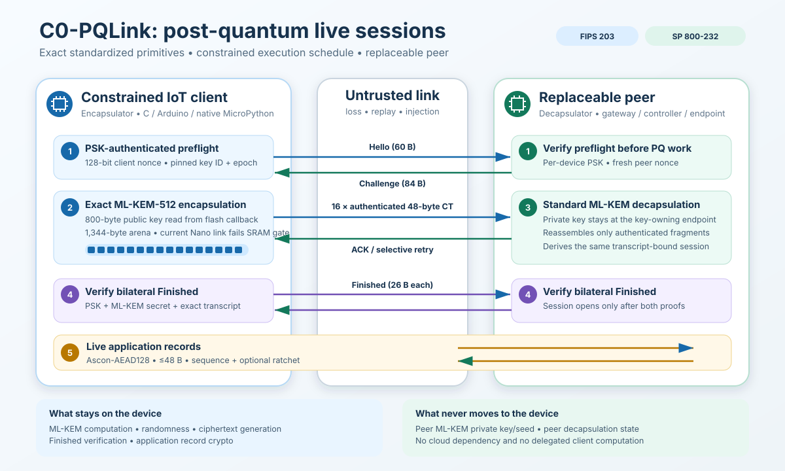

# C0-PQLink

**Post-quantum live sessions for severely constrained IoT clients.**

For the complete source-code map and the shortest verification commands, start
with [`START-HERE.md`](START-HERE.md).

C0-PQLink is an importable C/C++ and native MicroPython package. A constrained
device performs exact ML-KEM-512 encapsulation locally, streams the 768-byte
ciphertext through authenticated 48-byte fragments, verifies bilateral
Finished messages, and then protects application records with
Ascon-AEAD128.

This is a research preview, version 0.1.0. The standardized primitives have
test evidence; the C0-PQLink handshake is a new, unaudited protocol and is not
a NIST, IETF, TLS, or HPKE standard. Do not deploy it in safety-critical or
production systems without independent cryptographic review and target-device
validation.



## Scope lock

C0-PQLink is for **live network connections**. It is:

- an exact FIPS 203 ML-KEM-512 encapsulator on the device;
- a PSK-authenticated, loss-tolerant session handshake;
- an SP 800-232 Ascon-AEAD128 record layer;
- an Arduino/C++ library, portable C library, and native MicroPython module;
- paired with a replaceable reference peer for interoperability testing.

It is **not**:

- secure boot or firmware-update verification;
- SLH-DSA;
- a renamed or modified ML-KEM primitive;
- cloud-offloaded cryptography;
- a WebView demonstration;
- a new post-quantum primitive.

The reference peer owns the ML-KEM private key and decapsulates because that
is the normal KEM role split. The device still reads the public key, samples
its own randomness, performs every ML-KEM arithmetic operation, creates every
ciphertext byte, authenticates and fragments the ciphertext, derives the
session, verifies the peer Finished, and encrypts its own traffic.

### Purpose gate

C0-PQLink does not run PQC in the background or once per sensor message.
`begin()` only installs configuration. The application calls `connect()`
specifically to create a live session; an authenticated Challenge is verified
before ML-KEM starts. After the handshake, records use lightweight symmetric
cryptography, with optional chain-key evolution. Reconnect frequency is an
explicit measured policy, not an automatic “run PQ everywhere” decision.

## What changed to fit constrained clients

The ML-KEM mathematics and wire output are unchanged. The execution schedule
and session transport are changed:

| Constraint | C0-PQLink mechanism |
|---|---|
| 800-byte public key | Callback-backed reads from flash/PROGMEM |
| 768-byte ciphertext | Streamed; never stored as one device buffer |
| SRAM pressure | Two polynomial buffers, recomputation, and phase overlay |
| Small packet links | 16 authenticated fragments of 48 ciphertext bytes |
| Packet loss | Stop-and-wait ACK with bounded retry of only the lost fragment |
| Unauthenticated PQ work | PSK-authenticated Hello/Challenge preflight |
| Long-lived traffic | Optional per-record symmetric chain-key evolution |
| Fleet migration | One-way policy states plus authenticated A/B journal |

The internal ML-KEM workspace is currently 1,312 bytes; the public allocation
bound is 1,344 bytes. The current Nano link nevertheless uses 2,016 of 2,048
static SRAM bytes before any runtime stack, so this implementation does **not**
fit the ATmega328P. See `docs/HYPER-RESEARCH-VERDICT.md` for the replacement
execution design and its measurement gates.

## Wire budget

| Frame | Total bytes |
|---|---:|
| Authenticated Hello | 60 |
| Authenticated Challenge | 84 |
| Full ciphertext fragment | 77 |
| Fragment ACK | 28 |
| Finished | 26 |
| Maximum application record | 82 |

All C0-PQLink frames fit below 96 bytes. Link-layer headers and adaptation
overhead are outside this count.

## Arduino/C++

Import the release ZIP through **Arduino IDE → Sketch → Include Library → Add
.ZIP Library**, then:

```cpp
#include <C0PQLink.h>

C0PQLink::Client client;
C0PQLink::Workspace workspace;
```

Implement three adapters:

1. `PublicKeySource` reads the pinned 800-byte ML-KEM-512 public key, ideally
   from flash rather than SRAM.
2. `RandomSource` fills every requested byte from a TRNG, secure element, or
   correctly provisioned DRBG. There is deliberately no `analogRead()`
   fallback.
3. `Transport` sends and receives one opaque C0-PQLink frame at a time.

See `examples/LiveSensorClient`. Its default adapters fail closed, so the
example compiles but cannot falsely appear secure before board-specific
entropy, provisioning, and packet I/O are supplied.

## MicroPython

This is a native user C module, not a RAM-heavy pure-Python cryptographic
rewrite. Build it into MicroPython and freeze the facade:

```sh
make USER_C_MODULES=/absolute/path/C0-PQLink/micropython/micropython.cmake \
     FROZEN_MANIFEST=/absolute/path/C0-PQLink/micropython/manifest.py
```

Then application code imports the same session behavior:

```python
from c0pqlink import Client

link = Client(
    device_id,
    psk,
    epoch,
    peer_key_id,
    flash_public_key_reader,
    packet_transport,
    rng=board_secure_random,
).connect()

packet_transport.send(link.seal(b"temperature=24.5"))
reply = link.open(packet_transport.receive(96, 3000))
```

See `micropython/README.md` for Make- and CMake-based port integration.

## Portable C/CMake

The C API is under `include/c0pqlink`. Build with:

```sh
make
```

or:

```sh
cmake -S . -B build -DC0PQLINK_BUILD_TESTS=ON
cmake --build build
cmake --install build --prefix /chosen/prefix
```

Installed CMake consumers can use:

```cmake
find_package(c0pqlink CONFIG REQUIRED)
target_link_libraries(my_device PRIVATE C0PQLink::c0pqlink)
```

## Replaceable reference peer

`reference-peer/` proves an independently implemented opposite endpoint can
decapsulate the device ciphertext and exchange live protected records. It is
not device-side code and it is not a cloud requirement. Replace it with an
embedded Linux gateway, telecom endpoint, industrial controller, or another
language implementation of the documented wire protocol.

The peer uses `@noble/post-quantum` rather than the C implementation, making
the end-to-end test an independent ML-KEM interoperability check.

```sh
npm ci
npm run provision:demo
cp generated/reference-peer-config.json reference-peer/config.json
npm run peer
```

Never copy the peer configuration onto the device: it contains the ML-KEM
private seed and device PSK.

## Verification

Run:

```sh
npm ci
make verify
make size-report
```

Current automated gates:

- SHA3-256, SHA-256, HMAC-SHA-256, and HKDF-SHA-256 vectors;
- SP 800-232 Ascon-AEAD128 known-answer and tamper/zeroization checks;
- eight exact ML-KEM-512 ciphertext/shared-secret comparisons against an
  independent implementation;
- non-canonical ML-KEM public-key rejection;
- C client ↔ JavaScript peer handshake and application-record exchange;
- cross-language checks for both session modes;
- injected loss of Challenge, fragment ACK, Finished, and application-record
  responses;
- forged fragment, Finished, and record rejection with transactional state;
- exact sealed-record retransmission with cached idempotent peer response;
- replay rejection and migration-journal torn-write recovery;
- Arduino C++ API and fail-closed example host compilation;
- AddressSanitizer and UndefinedBehaviorSanitizer tests.

Rejected or not yet established:

- current named-Nano link: rejected at 2,016 static SRAM bytes before stack;
- whole-program stack high-water and interrupt margin;
- complete linked-binary constant-time evidence;
- native MicroPython firmware compilation for a named port;
- cycle, latency, energy, radio-airtime, and battery measurements;
- power/EM/fault-injection resistance;
- independent protocol or implementation audit.

See `docs/CLAIM-LEDGER.md` before making performance or security claims.

## Session modes

`FULL_PQ_EACH_SESSION` runs ML-KEM whenever a new session is established and
then uses fixed directional traffic keys with unique sequence-derived nonces.

`PQ_BOOTSTRAP_RATCHET` also runs ML-KEM at session establishment, then evolves
a directional chain key after every authenticated record. This limits
recovery of earlier record keys after a later chain-key compromise, assuming
erasure works. It is not a double ratchet, does not heal after compromise, and
does not replace periodic fresh PQ handshakes.

## Migration

The migration helper enforces:

```text
LEGACY_PSK -> PSK_PLUS_PQ -> PQ_REQUIRED_WITH_PSK_AUTH
```

An authenticated two-slot journal survives a torn write and refuses policy or
epoch rollback. Physical rollback of all nonvolatile storage still requires a
hardware monotonic counter or equivalent platform support. See
`docs/MIGRATION.md`.

## Standards and design references

- [NIST FIPS 203: ML-KEM](https://csrc.nist.gov/pubs/fips/203/final)
- [NIST SP 800-232: Ascon-based lightweight cryptography](https://csrc.nist.gov/pubs/sp/800/232/final)
- [RFC 5869: HKDF](https://www.rfc-editor.org/rfc/rfc5869.html)
- [RFC 8446: TLS 1.3 transcript/Finished design reference](https://www.rfc-editor.org/rfc/rfc8446.html)
- [RFC 4944: IPv6 over IEEE 802.15.4 adaptation context](https://www.rfc-editor.org/rfc/rfc4944.html)
- [IETF constrained-PQC guidance (work in progress)](https://datatracker.ietf.org/doc/draft-ietf-pquip-pqc-hsm-constrained/)

These references standardize primitives or informed design patterns. They do
not standardize C0-PQLink. Review the current NIST FIPS 203 errata and the
current Internet-Draft revision before a release.

## Documentation

- `docs/PROTOCOL.md` — exact wire format and key schedule
- `docs/THREAT-MODEL.md` — protected properties, assumptions, and exclusions
- `docs/MIGRATION.md` — staged fleet transition and A/B journal
- `docs/CLAIM-LEDGER.md` — verified, bounded, and pending claims
- `docs/RELEASE-EVIDENCE.md` — exact 0.1.0 host evidence and skipped gates
- `docs/JUDGE-GATES.md` — role-based evaluation gates for the supplied panel
- `docs/RESEARCH-MAP.md` — standards, drafts, and rejected alternatives
- `docs/HYPER-RESEARCH-VERDICT.md` — quantified Nano candidate screen and
  provisional RPE-32 execution design
- `docs/PHASE-1-SCORING-MAP.md` — evidence mapped to the 50-mark review rubric
- `docs/DEMO.md` — reproducible hackathon demonstration
- `SECURITY.md` — deployment warnings and review checklist

Licensed under Apache-2.0.
